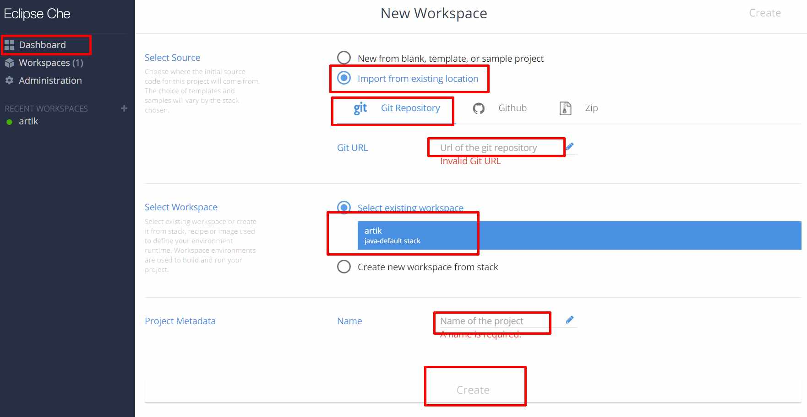
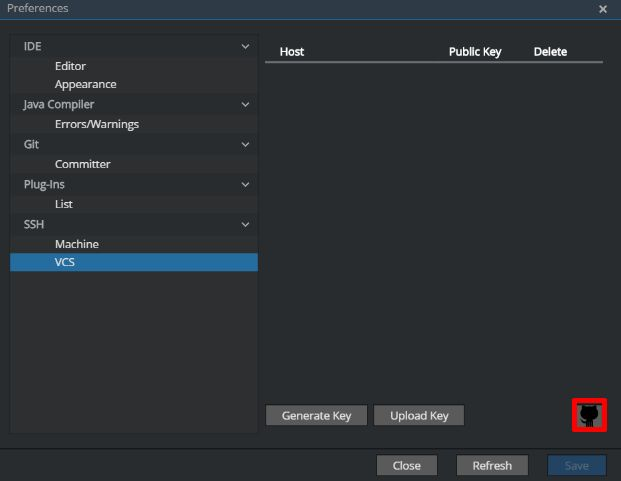
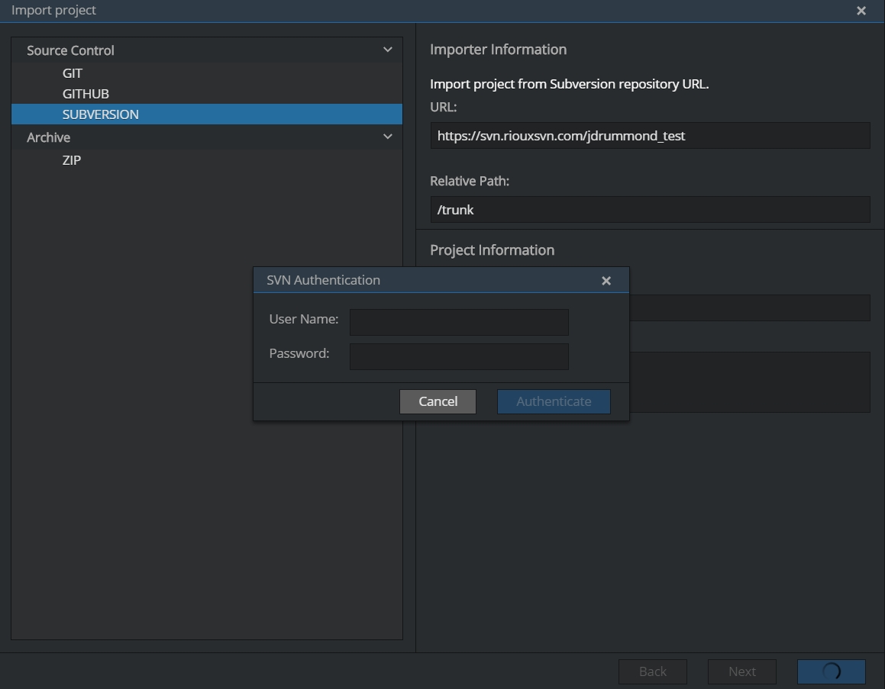
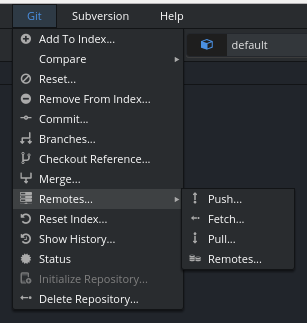

Che natively supports Git and SVN, which is installed in all pre-defined Che images. Versioning functionality is available in the IDE and in the terminal. When using the Git and SVN menu, commands are injected into the workspace runtime and all output is streamed into the consoles panels. The following sections are in reference to Che's IDE Git and SVN Menu.
# Using Private Repositories  
Private repositories will require a secure SSH connection, so an SSH key pair needs to be generated. SSH keys are saved in user preferences, so you need to generate the SSH key only once and it will be used in all workspaces.

##Generate New SSH Keys
SSH keys can be generated at `Profile > Preferences > SSH > VCS`. Use the `Generate Key` button and manually save the resulting key to your Git hosting provider account. When prompted to provide the hostname for your repo, make sure it is a bare hostname (no www or http/https) as in the example below.


After the key has been generated, you can view and copy it, and save to your repository hosting account.


##Use Existing SSH Keys
You can upload an existing public key instead of creating a new SSH key. When uploading a key add the hostname (using no www or http/https - as in the example below). Note that the `public key > view` button will not be available with this option as the public file should be generated already.

## Adding SSH Public Key to Repository Account
Each repository provider has their own specific way to upload SSH public keys. This is required to use features such as `push` from the Git or Subversion menu in the workspace. 

## Git SSH Examples
The following example is specific to GitHub and GitLab but can be used with all git or SVN repository providers that use SSH authentication. Please refer to documentation provided by other providers for additional assistance.

### GitHub Example
To add the associated public key to a repository/account  using **github.com** click your user icon(top right) then `settings > ssh and gpg keys > new ssh key`. Give a title to your liking and paste the public key copied from Che into form.


### GitLab Example
To add the associated public key to a git repository/account  using **gitlab.com** click your user icon(top right) then `Profile Settings > SSH Keys`. Give a title to your liking and paste the public key copied from Che into form.

## Import Project from Repository Using SSH
Import project from the IDE `Workspace > Import Project > GIT/SUBVERSION` menu.

Importing a project can also be done from the dashboard menu.

Be sure to use the ssh url like `git@<git url>:<account>/<project>.git` when importing a project from a git repository using ssh key authorization. **Note: HTTPS git url can only be used for oauth authentication described in [Git Using oAuth](https://eclipse-che.readme.io/docs/git#github-using-oauth)**. 
# Git Using oAuth  
## GitLab oAuth
Currently it's not possible for Che to use oAuth integration with GitLab. Although GitLab supports oAuth for clone operations, pushes are not supported. You can track [this GitLab issue](https://gitlab.com/gitlab-org/gitlab-ce/issues/18106) in their issue management system.

## GitHub oAuth
### Setup oAuth at GitHub
To enable automatic key upload to GitHub, register an application in your GitHub account `Setting > oAuth Applications > Developer Applications` with the callback `http://<HOST_IP>:<SERVER_PORT>/wsmaster/api/oauth/callback`:


### Setup environment variables.
Set the following to environment variables then start/restart the Eclipse Che server. Optionally you can use [CLI profiles](https://eclipse-che.readme.io/docs/che-cli#profiles) to save these environment variables.
```shell  
export CHE_PROPERTY_oauth_github_clientid=yourClientID
export CHE_PROPERTY_oauth_github_clientsecret=yourClientSecret
export CHE_PROPERTY_oauth_github_authuri= https://github.com/login/oauth/authorize
export CHE_PROPERTY_oauth_github_tokenuri= https://github.com/login/oauth/access_token
export CHE_PROPERTY_oauth_github_redirecturis= http://${CHE_HOST_IP}:${SERVER_PORT}/wsmaster/api/oauth/callback
#Optionally save the enviroment variables above using the CLI.
#che profile add <profile-name>
#che profile set <profile-name>
che start\
```
### Using OAuth in Workspace
Once the oauth is setup, SSH keys are generated and uploaded automatically for GitHub at `Profile > Preferences > SSH > VCS` by clicking the 'Octocat' icon.

### Import Existing Project
Import project from the IDE `Workspace > Import Project > GITHUB` menu. When importing a project from GitHub using oauth key authorization you can use the https url like `https://github.com/<account>/<project>.git`. 

Importing a project can also be done from the dashboard menu.
# SVN Using Username/Password  
Import project from the IDE `Workspace > Import Project > SUBVERSION` menu. When importing a project from you can use the https url like `https://<hostname>/<repo-name>`. 


# Set Git Committer Name and Email  
Committer name and email are set in `Profile > Preferences > Git > Committer`. Once set each commit will include this information.


# Git Workspace Clients  
After importing repository, you can perform the most common Git operations using interactive menus or as console commands.


